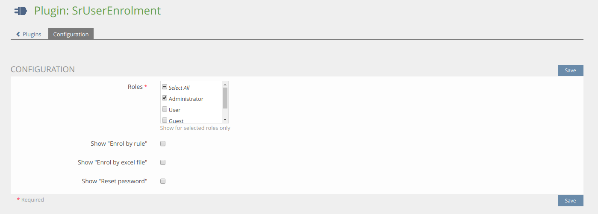
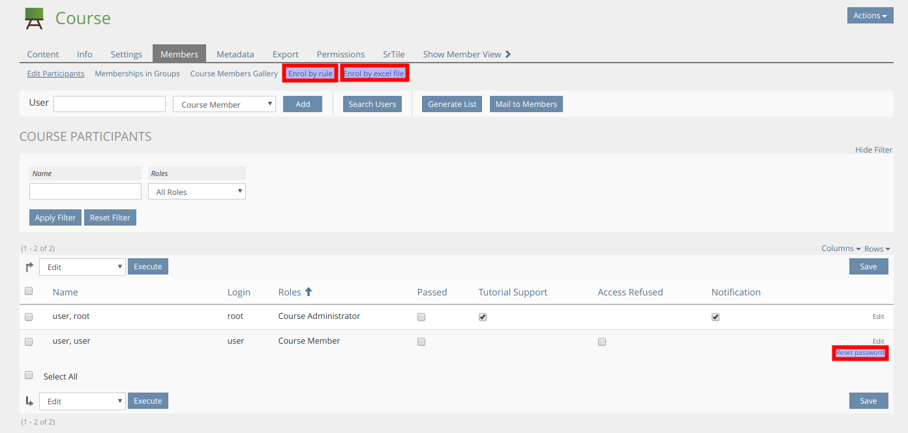
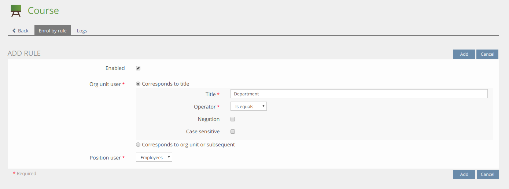
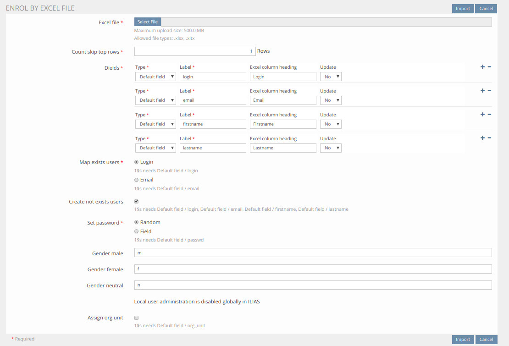
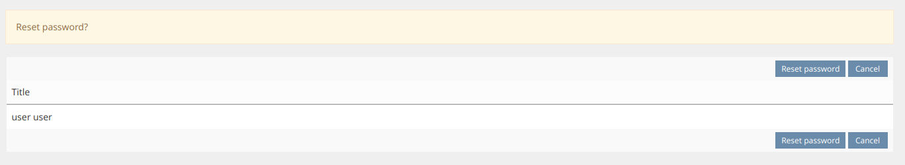

<!-- Autogenerated from composer.json - All changes will be overridden if generated again! -->

# SrUserEnrolment ILIAS Plugin

Enrol users such with an excel file or by rules

This project is licensed under the GPL-3.0-only license

## Requirements

* ILIAS 6.0 - 6.999
* PHP >=7.0

## Installation

Start at your ILIAS root directory

```bash
mkdir -p Customizing/global/plugins/Services/UIComponent/UserInterfaceHook
cd Customizing/global/plugins/Services/UIComponent/UserInterfaceHook
git clone https://github.com/fluxapps/SrUserEnrolment.git SrUserEnrolment
```

Update, activate and config the plugin in the ILIAS Plugin Administration

## Description

### Cron job plugin

If you want to use "Enrol by rule" or "Enrolment workflow", you need to install the [SrUserEnrolmentCron](https://github.com/fluxapps/SrUserEnrolmentCron) plugin

### Main features

This plugin has the follow main features (Each needs to activated separated in the plugin config)





**Automatic enroll members to course by rules**


**Enroll members to course with an excel file**


**Reset course members password**


**Enrolment workflow**


### Custom event plugins

If you need to do some custom requests changes, SrUserEnrolment will trigger some events, you can listen and react to this in an other custom plugin (plugin type is no matter)

First create or extend a `plugin.xml` in your custom plugin (You need to adapt `PLUGIN_ID` with your own plugin id) to tell ILIAS, your plugins wants to listen to SrUserEnrolment events (You need also to increase your plugin version for take effect)

```xml
<?php xml version = "1.0" encoding = "UTF-8"?>
<plugin id="PLUGIN_ID">
	<events>
		<event id="Plugins/SrUserEnrolment" type="listen" />
	</events>
</plugin>
```

In your plugin class implement or extend the `handleEvent` method

```php
...
require_once __DIR__ . "/../../SrUserEnrolment/vendor/autoload.php";
...
class ilXPlugin extends ...
...
	/**
	 * @inheritDoc
	 */
	public function handleEvent(/*string*/ $a_component, /*string*/ $a_event, /*array*/ $a_parameter)/*: void*/ {
		switch ($a_component) {
			case IL_COMP_PLUGIN . "/" . ilSrUserEnrolmentPlugin::PLUGIN_NAME:
				switch ($a_event) {
					case ilSrUserEnrolmentPlugin::EVENT_...:
						...
						break;

					default:
						break;
				}
				break;

			default:
				break;
		}
	}
...
```

| Event | Parameters | Purpose |
|-------|------------|---------|
| `ilSrUserEnrolmentPlugin::AFTER_REQUEST` | `request => object<Request>` | After a request is done |
| `ilSrUserEnrolmentPlugin::EVENT_COLLECT_REQUEST_STEP_FOR_OTHERS_TABLE_MODIFICATIONS` | `modifications => ArrayObject<AbstractRequestStepForOthersTableModifications>` | Collect request step for others table modifications |
| `ilSrUserEnrolmentPlugin::EVENT_COLLECT_MEMBERS_TABLE_MODIFICATIONS` | `modifications => ArrayObject<AbstractMembersTableModifications>` | Collect members table modifications |
| `ilSrUserEnrolmentPlugin::EVENT_COLLECT_MEMBER_FORM_MODIFICATIONS` | `modifications => ArrayObject<AbstractMemberFormModifications>` | Collect member form modifications |
| `ilSrUserEnrolmentPlugin::EVENT_COLLECT_REQUESTS_TABLE_MODIFICATIONS` | `modifications => ArrayObject<AbstractRequestsTableModifications>` | Collect requests table modifications |
| `ilSrUserEnrolmentPlugin::EVENT_EXTENDS_SRUSRENR` | - | Extends SrUserEnrolment |
